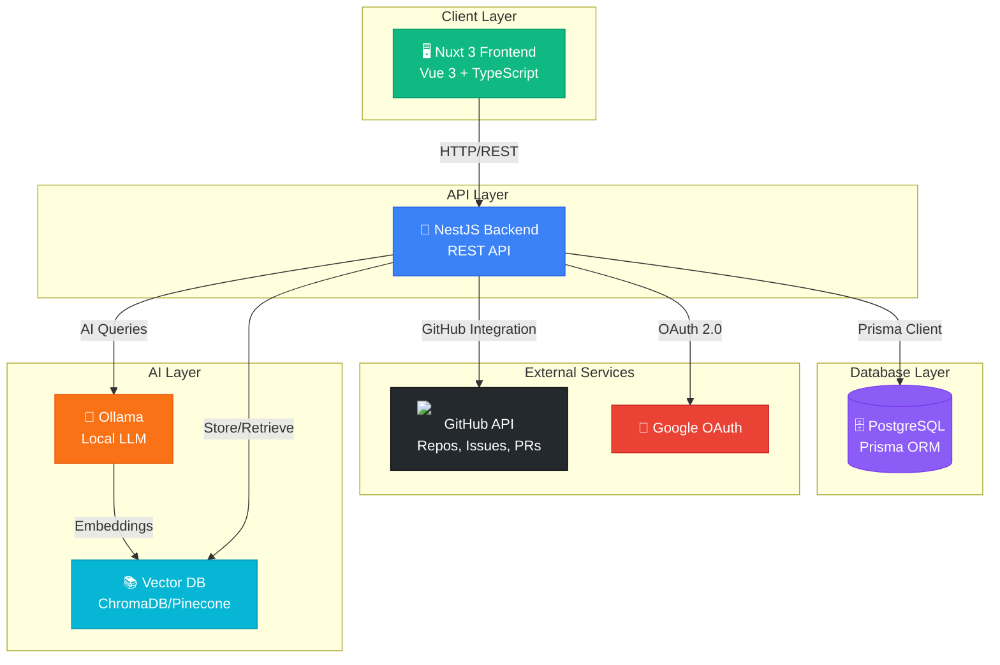
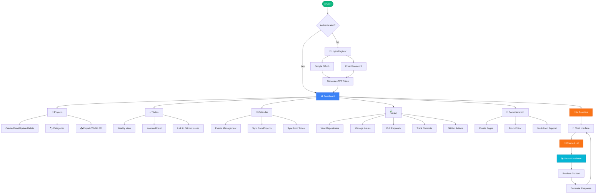
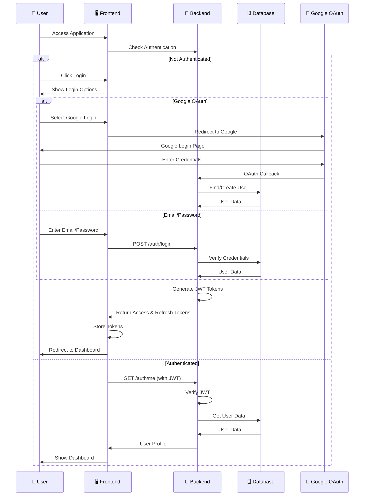
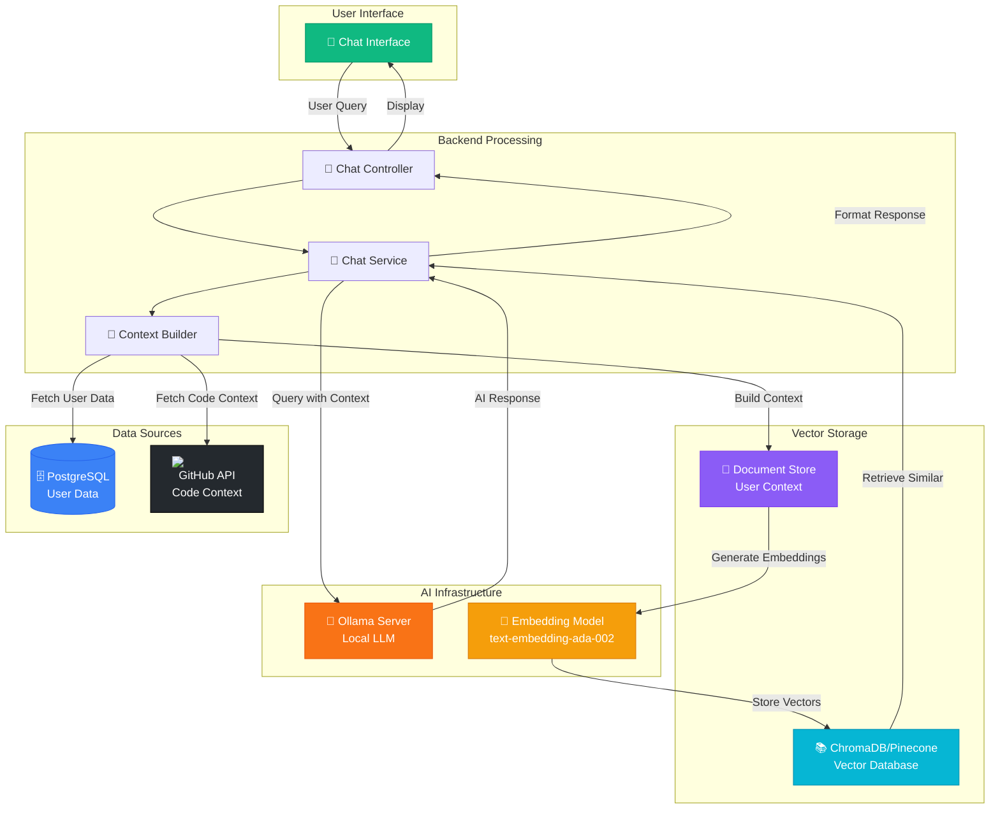
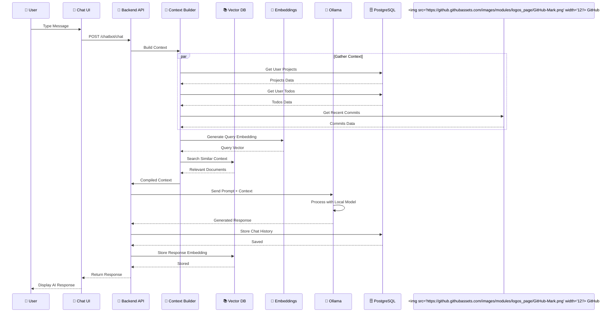
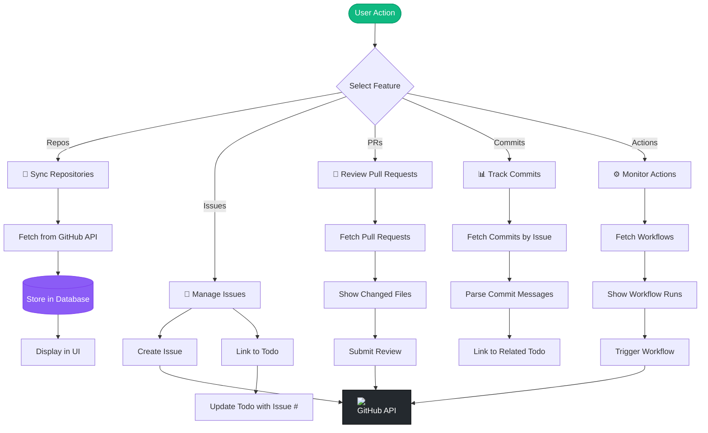
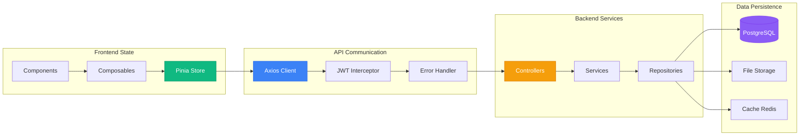
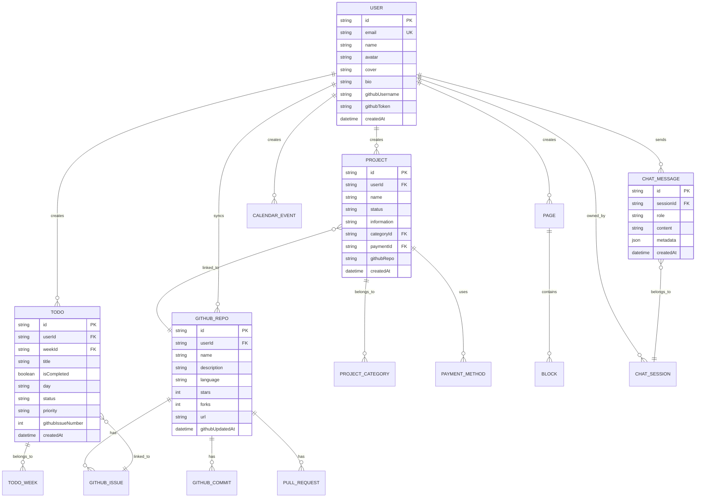
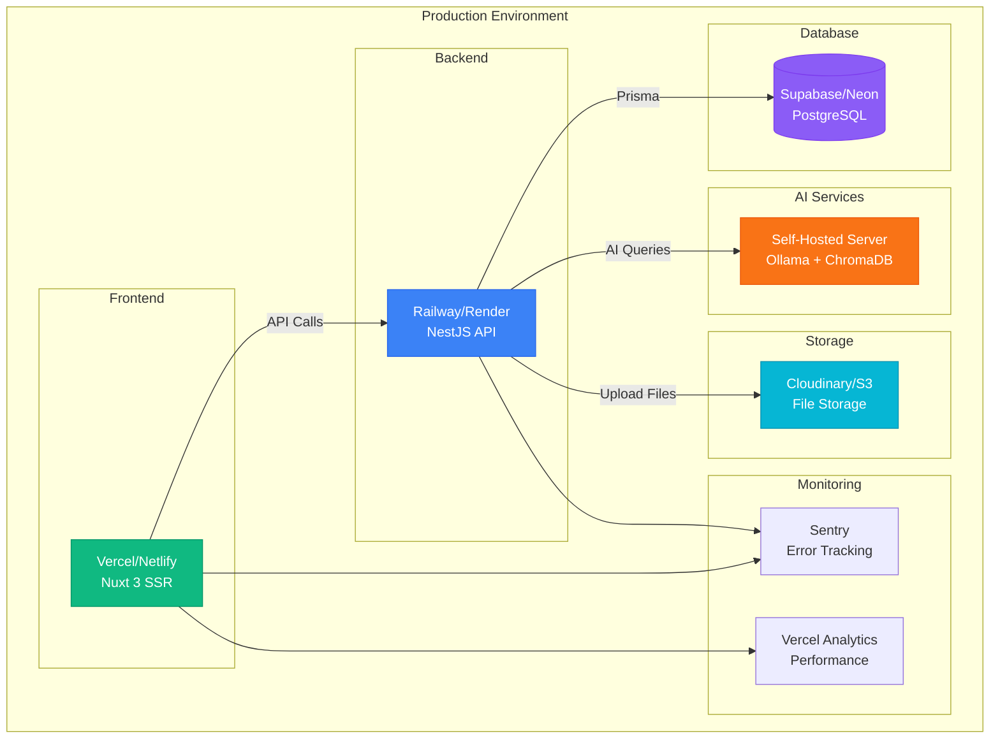
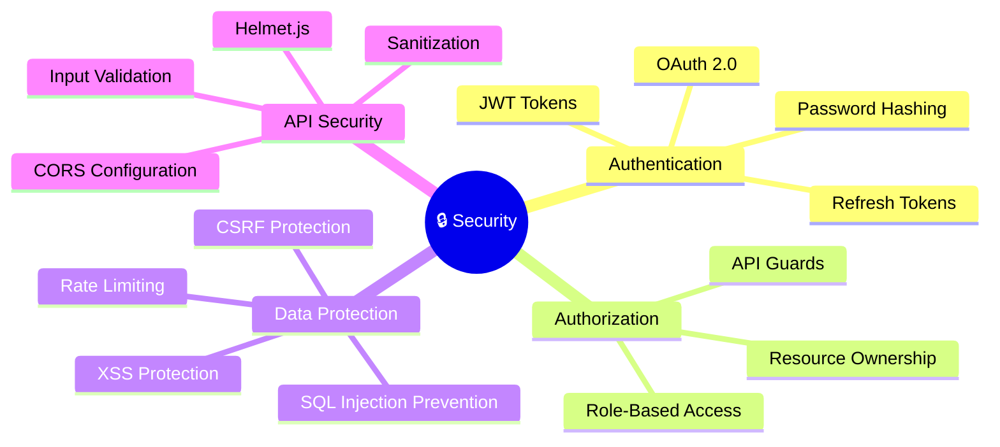

# 🏗️ Devion System Architecture

## System Overview

Devion adalah platform manajemen proyek dan produktivitas yang terintegrasi dengan GitHub, dilengkapi dengan AI chatbot menggunakan Ollama dan vector database untuk intelligent assistance.

---

## 📊 High-Level Architecture

---

## 🔄 Complete System Flow

---

## 🔐 Authentication Flow

---

## 🤖 AI Chatbot Architecture

---

## 🔄 AI Chat Flow (Detailed)

---

## 🔗 GitHub Integration Flow

---

## 📊 Data Flow Architecture

---

## 🗄️ Database Schema Overview

---

## 🚀 Deployment Architecture

---

## 🔧 Technology Stack

### Frontend

- **Framework**: Nuxt 3 (Vue 3 + TypeScript)
- **UI Library**: Nuxt UI (Tailwind CSS)
- **State Management**: Pinia
- **HTTP Client**: Axios
- **Charts**: Chart.js, Vue-ChartJS
- **Icons**: Lucide Icons

### Backend

- **Framework**: NestJS (Node.js + TypeScript)
- **ORM**: Prisma
- **Authentication**: JWT, Passport.js
- **Validation**: class-validator
- **File Upload**: Multer
- **API Documentation**: Swagger (optional)

### Database

- **Primary**: PostgreSQL
- **ORM**: Prisma
- **Migrations**: Prisma Migrate

### AI & ML

- **LLM**: Ollama (Local)
- **Vector DB**: ChromaDB / Pinecone
- **Embeddings**: OpenAI / Local Models

### External Services

- **GitHub API**: Repos, Issues, PRs, Actions
- **Google OAuth**: Authentication
- **File Storage**: Cloudinary / AWS S3

---

## 📝 API Endpoints Summary

### Authentication

- `POST /auth/register` - Register new user
- `POST /auth/login` - Login user
- `POST /auth/refresh` - Refresh access token
- `GET /auth/me` - Get current user
- `PATCH /auth/profile` - Update profile

### Projects

- `GET /projects` - Get all projects
- `POST /projects` - Create project
- `PATCH /projects/:id` - Update project
- `DELETE /projects/:id` - Delete project
- `GET /projects/export/csv` - Export to CSV

### Todos

- `GET /todos/current-week` - Get current week todos
- `POST /todos` - Create todo
- `PATCH /todos/:id` - Update todo
- `POST /todos/reorder` - Reorder todos

### GitHub

- `GET /github/repos` - Get repositories
- `POST /github/sync` - Sync repositories
- `GET /github/recent-commits` - Get recent commits
- `POST /github/repos/:owner/:repo/issues` - Create issue

### AI Chatbot

- `POST /chatbot/chat` - Send message to AI
- `GET /chatbot/history` - Get chat history
- `DELETE /chatbot/session/:id` - Clear session

### Calendar

- `GET /calendar` - Get events
- `POST /calendar` - Create event
- `GET /calendar/sync/projects` - Sync from projects
- `GET /calendar/sync/todos` - Sync from todos

---

## 🔒 Security Features

---

## 📈 Performance Optimization

- **Frontend**: Code splitting, lazy loading, image optimization
- **Backend**: Database indexing, query optimization, caching
- **API**: Response compression, pagination, rate limiting
- **AI**: Vector search optimization, context caching

---

## 🎯 Future Enhancements

1. **Real-time Collaboration** - WebSocket integration
2. **Mobile App** - React Native / Flutter
3. **Advanced Analytics** - Custom dashboards
4. **Team Features** - Multi-user workspaces
5. **AI Improvements** - Fine-tuned models, better context

---

**Last Updated**: 2024
**Version**: 1.0.0
